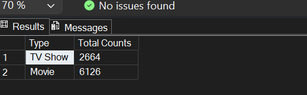

# Netflix Data Analysis Project using SQL

##  Table of Contents
- [Overview](#overview)
- [Dataset](#dataset)
- [Database Schema](#database-schema)
- [Data Cleaning](#data-cleaning)
- [Data Exploration](#data-exploration)
- [Business Problems](#business-problems-solved)
- [SQL Concepts](#SQL-Concepts-used)
- [Files](#Files)
- [Key Findings](#key-findings--conclusions)
- [Author](#author)

---

## Overview

This project involves an end-to-end data analysis of the Netflix dataset using Microsoft SQL Server (MSSQL). The goal is to explore the data, uncover key business insights, and answer real-world business questions through structured SQL queries.

The analysis covers:
- Content distribution between Movies and TV Shows
- Most common ratings across content types
- Country-wise and genre-wise content analysis
- Top actors and directors on Netflix
- Content categorization based on keywords

**Tool:** Microsoft SQL Server (MSSQL/SSMS)
**Skills:** Data Cleaning, EDA, Advanced SQL, STRING_SPLIT, Window Functions, CTEs, Subqueries

---

##  Dataset
| Detail | Info |
|---|---|
| Source | [Kaggle-Netflix Movies and TV Shows](https://www.kaggle.com/datasets/shivamb/netflix-shows) |
| Total Records | 8807 |
| Total Columns | 12 |

---

##  Database Schema
**Database:** NETFLIX
**Table:** netflix

| Column | Data Type | Description |
|---|---|---|
| show_id | VARCHAR(6) | Unique ID for each title |
| type | VARCHAR(10) | Movie or TV Show |
| title | VARCHAR(150) | Title of the content |
| director | NVARCHAR(MAX) | Director(s) name |
| cast | NVARCHAR(MAX) | List of actors |
| country | VARCHAR(150) | Country of production |
| date_added | VARCHAR(50) | Date added to Netflix |
| release_year | INT | Year of release |
| rating | VARCHAR(10) | Content rating |
| duration | VARCHAR(15) | Duration in mins or seasons |
| listed_in | NVARCHAR(MAX) | Genre(s) |
| description | NVARCHAR(MAX) | Brief description |

---

##  Data Cleaning

###  Checking NULL values across all 12 columns
```sql
SELECT 
    COUNT(*) - COUNT(show_id)      AS [show_id NULL],
    COUNT(*) - COUNT(type)         AS [type NULL],
    COUNT(*) - COUNT(title)        AS [title NULL],
    COUNT(*) - COUNT(director)     AS [director NULL],
    COUNT(*) - COUNT(cast)         AS [cast NULL],
    COUNT(*) - COUNT(country)      AS [country NULL],
    COUNT(*) - COUNT(date_added)   AS [date_added NULL],
    COUNT(*) - COUNT(release_year) AS [release_year NULL],
    COUNT(*) - COUNT(rating)       AS [rating NULL],
    COUNT(*) - COUNT(duration)     AS [duration NULL],
    COUNT(*) - COUNT(listed_in)    AS [listed_in NULL],
    COUNT(*) - COUNT(description)  AS [description NULL]
FROM netflix;
```
**Finding:** `director` had the highest NULLs (~30%), followed by `cast` and `country`

###  Deleting critical NULL rows
Rows where `date_added`, `rating`, or `duration` were NULL were deleted as they are critical for analysis
```sql
DELETE FROM netflix
WHERE (
    date_added IS NULL
    OR rating   IS NULL
    OR duration IS NULL
);
```

###  Filling remaining NULLs with default values
Instead of deleting high NULL% columns, filled with meaningful default values to preserve data
```sql
UPDATE netflix SET director = 'Unknown' WHERE director IS NULL;
UPDATE netflix SET cast     = 'Unknown' WHERE cast     IS NULL;
UPDATE netflix SET country  = 'Unknown' WHERE country  IS NULL;
```

###  Checking for duplicate records
```sql
SELECT * FROM (
    SELECT *,
        ROW_NUMBER() OVER(
            PARTITION BY show_id
            ORDER BY show_id
        ) AS row_num
    FROM netflix
) AS T1
WHERE row_num > 1;
```
**Finding:** No duplicates were found in the dataset 

---

##  Data Exploration

- **Total Content:** Checked the total number of records in the dataset
```sql
SELECT COUNT(*) AS [Total Content]
FROM netflix;
```
- **Types of Shows:** Found 2 distinct types: Movie and TV Show
```sql
SELECT DISTINCT type AS [Type]
FROM netflix;
```
- **Total Columns:** 12 columns in the dataset
```sql

SELECT COUNT(*) AS [Total Columns]
FROM INFORMATION_SCHEMA.COLUMNS
WHERE TABLE_NAME = 'netflix';
```
- **Total Directors:** Counted unique directors
```sql
SELECT COUNT(DISTINCT director) AS [Total Directors]
FROM netflix
WHERE director!='Unknown';
```
- **Total Countries:** Counted unique countries
```sql
SELECT COUNT(DISTINCT TRIM(value)) AS [Total Countries]
FROM netflix
CROSS APPLY STRING_SPLIT(country, ',')
WHERE TRIM(value) != 'Unknown';
```

---

## Business Problems Solved

### Q1. Count of Movies vs TV Shows
**Purpose:** Understand content type distribution on Netflix
```sql
SELECT 
    type     AS [Type],
    COUNT(*) AS [Total Count]
FROM netflix
GROUP BY type
ORDER BY COUNT(*) DESC;
```
**Finding:** Movies dominate Netflix with approximately 3x more content than TV Shows


---

### Q2. Most Common Rating for Movies and TV Shows
**Purpose:** Find under what rating most content is listed
```sql
SELECT * FROM (
    SELECT 
        type,
        rating,
        RANK() OVER(
            PARTITION BY type
            ORDER BY COUNT(*) DESC
        ) AS [Rank]
    FROM netflix
    GROUP BY type, rating
) AS T1
WHERE Rank = 1;
```
**Finding:** TV-MA is the most common rating for both Movies and TV Shows on Netflix

---

### Q3. Movies Released Per Year
**Purpose:** Find how many movies got released each year
```sql
SELECT 
    release_year AS [Release Year],
    COUNT(*)     AS [Total Count]
FROM netflix
GROUP BY release_year
ORDER BY release_year;
```
 **Finding:** Number of movies released per year has been gradually increasing over time

---

### Q4. Top 5 Countries with Most Content on Netflix
**Purpose:** Identify which countries produce the most content
```sql
SELECT TOP 5
    TRIM(value)  AS [Country],
    COUNT(*)     AS [Total Movies]
FROM netflix
CROSS APPLY STRING_SPLIT(country, ',')
GROUP BY TRIM(value)
HAVING TRIM(value) != 'Unknown'
ORDER BY COUNT(*) DESC;
```
**Finding:** United States leads by a large margin, followed by India, United Kingdom, Canada, and France

---

### Q5. Identify the Longest Movie
**Purpose:** Find the movie with the highest duration
```sql
SELECT TOP 1
    title AS [Movie],
    CAST(REPLACE(duration, 'min', '') AS INT) AS [Duration]
FROM netflix
WHERE type = 'movie'
ORDER BY CAST(REPLACE(duration, 'min', '') AS INT) DESC;
```
**Finding:** 'Black Mirror: Bandersnatch' is the longest movie on Netflix

---

### Q6. Content Released Between 2017 and 2021
**Purpose:** Find content released in a specific time range
```sql
SELECT *
FROM netflix
WHERE release_year BETWEEN 2017 AND 2021
ORDER BY release_year;
```

---

### Q7. All Movies Directed by Rajiv Chilaka
**Purpose:** Find all movies directed by a specific director
```sql
SELECT title AS [Movie Name]
FROM netflix
CROSS APPLY STRING_SPLIT(director, ',')
WHERE 
    TRIM(value) = 'Rajiv Chilaka'
    AND type    = 'Movie';
```
**Finding:** Rajiv Chilaka has directed 19 movies on Netflix

---

### Q8. TV Shows with More Than 5 Seasons
**Purpose:** Find long-running series with extensive storylines
```sql
SELECT title AS [Series Name]
FROM netflix
WHERE 
    type = 'TV Show'
    AND CAST(
            TRIM(
                REPLACE(REPLACE(duration, 'Seasons', ''),
                'Season', '')
            ) AS INT
        ) > 5
ORDER BY 
    CAST(
        TRIM(
            REPLACE(REPLACE(duration, 'Seasons', ''),
            'Season', '')
        ) AS INT
    ) DESC;
```
**Finding:** 96 TV Shows have more than 5 seasons on Netflix

---

### Q9. Content Count by Genre
**Purpose:** Figure out which genre has the most content
```sql
SELECT
    TRIM(value) AS [Genre],
    COUNT(*)    AS [Total Content]
FROM netflix
CROSS APPLY STRING_SPLIT(listed_in, ',')
GROUP BY TRIM(value)
ORDER BY COUNT(*) DESC;
```
**Finding:** International Movies is the genre with the highest amount of content on Netflix

---

### Q10. Top 5 Years — Average Content Released by India
**Purpose:** Find years when India added the most content
```sql
SELECT TOP 5
    YEAR(CAST(date_added AS DATE)) AS [Year Added],
    COUNT(*)                       AS [Total Content],
    ROUND(COUNT(*) * 100.0 /
        (
            SELECT COUNT(*)
            FROM netflix
            CROSS APPLY STRING_SPLIT(country, ',')
            WHERE TRIM(value) = 'India'
        ), 2)                      AS [Percentage]
FROM netflix
CROSS APPLY STRING_SPLIT(country, ',')
WHERE TRIM(value) = 'India'
GROUP BY YEAR(CAST(date_added AS DATE))
ORDER BY COUNT(*) DESC;
```
**Finding:** The pre-COVID period was when India produced the most content on Netflix

---

### Q11. Movies Listed as Documentaries
**Purpose:** Find all content categorized as documentaries
```sql
SELECT *
FROM netflix
CROSS APPLY STRING_SPLIT(listed_in, ',')
WHERE TRIM(Value) = 'Documentaries';
```
**Finding:** There are 869 documentaries on Netflix

---

### Q12. Content Without a Director
**Purpose:** Find rows where director information is unavailable
```sql
SELECT *
FROM netflix
WHERE director = 'Unknown';
```

---

### Q13. Salman Khan Movies in Last 10 Years
**Purpose:** Find how active Salman Khan has been on Netflix
```sql
SELECT 
    TRIM(Value)  AS [Actor],
    COUNT(*)     AS [Appearances]
FROM netflix
CROSS APPLY STRING_SPLIT(cast, ',')
WHERE 
    TRIM(Value)       = 'Salman Khan'
    AND release_year BETWEEN 2012 AND 2021
GROUP BY TRIM(Value);
```
**Finding:** Salman Khan appeared in only 3 movies in the last 10 years on Netflix

---

### Q14. Top 10 Actors in Indian Movies
**Purpose:** Find most active actors in Indian content
```sql
SELECT TOP 10
    TRIM(a.Value) AS [Actor],
    COUNT(*)      AS [Appearances]
FROM netflix
CROSS APPLY STRING_SPLIT(cast, ',')    a
CROSS APPLY STRING_SPLIT(country, ',') b
WHERE 
    TRIM(b.Value)  = 'India'
    AND TRIM(a.Value) != 'Unknown'
    AND type       = 'Movie'
GROUP BY TRIM(a.Value)
ORDER BY COUNT(*) DESC;
```
**Finding:** Anupam Kher has the most appearances in Indian movies, followed by Shah Rukh Khan

---

### Q15. Content Categorized by Violent Keywords
**Purpose:** Differentiate between violent and
            non-violent content on Netflix
```sql
WITH CategoryCTE AS (
    SELECT DISTINCT show_id, title,
        CASE
            WHEN description LIKE '%kill%'
              OR description LIKE '%violence%'
            THEN 'Bad'
            ELSE 'Good'
        END AS [Category]
    FROM netflix
)
SELECT
    Category,
    COUNT(*) AS [Total Content]
FROM CategoryCTE
GROUP BY Category;
```
**Finding:** ~96% of Netflix content is categorized as 'Good' while only ~4% contains violent keywords

---

##  SQL Concepts Used
- DDL: CREATE DATABASE, CREATE TABLE
- DML: INSERT, DELETE, UPDATE, SELECT
- Aggregate Functions: SUM, COUNT, AVG, ROUND
- Window Functions: RANK, PARTITION BY, ROW_NUMBER
- CASE Statements
- CTEs (Common Table Expressions)
- Subqueries
- STRING_SPLIT + CROSS APPLY
- CAST, CONVERT, REPLACE, TRIM
- DATEPART for time-based analysis
- Filtering: WHERE, HAVING, AND, OR, IS NULL, LIKE

---

##  Files

| File | Description |
|---|---|
| [NETFLIX.sql](https://github.com/Sanjeevan-Pal/Netflix-Data-Analysis-SQL/blob/main/NETFLIX.sql) | All SQL queries |
| [netflix_titles.csv](https://github.com/Sanjeevan-Pal/Netflix-Data-Analysis-SQL/blob/main/netflix_titles.csv) | Raw Netflix dataset |
| [RESULTS](https://github.com/Sanjeevan-Pal/Netflix-Data-Analysis-SQL/tree/main/RESULTS) | Screenshot of results |

---

##  Key Findings & Conclusions

- **Content Distribution:** Movies dominate Netflix with ~3x more content than TV Shows

- **Most Common Rating:** TV-MA is the most common rating for both Movies and TV Shows

- **Top Producing Country:** United States leads content production by a large margin

- **Longest Movie:** Black Mirror: Bandersnatch is the longest movie on Netflix

- **India on Netflix:** Pre-COVID years (2018-2019) saw the highest content addition from India

- **Most Active Actor:** Anupam Kher has the most appearances in Indian movies on Netflix

- **Genre Insights:** International Movies is the most listed genre on the platform

- **Content Safety:** ~96% of Netflix content is free from violent keywords in descriptions

---

#  Author
**Sanjeevan Pal**
- This project is part of my portfolio, showcasing my SQL skills essential for data analyst roles.
- [LinkedIn](https://www.linkedin.com/in/sanjeevan-pal-60444737b/) | [GitHub](https://github.com/Sanjeevan-Pal)
